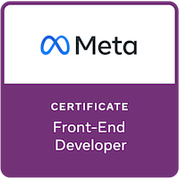
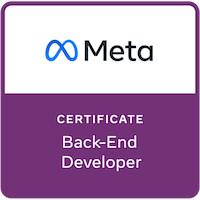
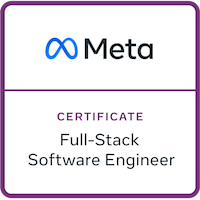
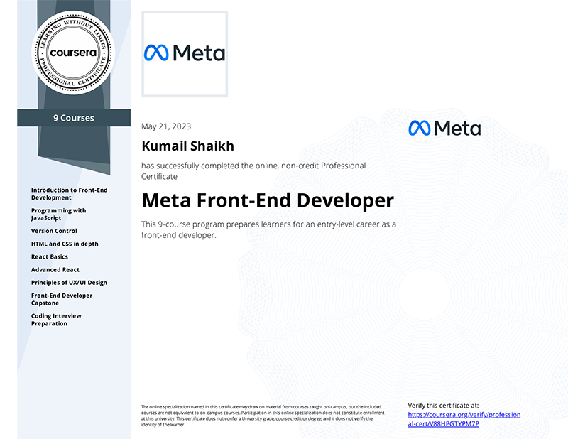
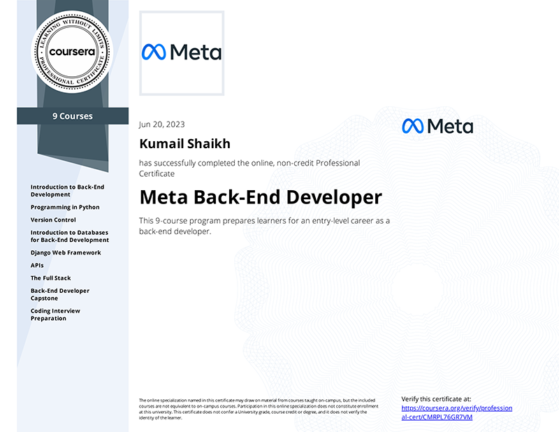

<table>
    <thead>
        <tr>
            <th width=600px>
                
            </th>
            <th width="300">
                

                    
                

            </th>
        </tr>
    <thead>
</table>

<h2><strong>🗒️ About</strong></h2>

    Full-Stack software engineer with experience in developing web applications. I have worked on various projects for clients as well as created personal projects, ranging from full e-commerce platforms to RESTful APIs. I am proficient in <strong>HTML</strong>, <strong>CSS</strong>, <strong>JavaScript</strong>, <strong>React JS</strong>, <strong>Python</strong>, <strong>Django</strong>, <strong>DRF (Django REST Framework)</strong>, <strong>SQL</strong> and other technologies. I am very enthusiastic about creating user-friendly and scalable solutions that meet the needs and expectations of my clients. I am always eager to learn new skills and explore new challenges in the field of software engineering.
    <h3><a href=""><code>⬇️ Download Resume</code></a></h3>
    

<h2><strong>🎓 Education</strong></h2>
<table>
    <!-- <thead>
        <tr>
            <th></th>
            <th></th>
        </tr>
    </thead> -->
    <tbody>
        <tr>
            <td align="center" valign="top"></td>
            <td>
                

                    <strong>Bachelor of Science (BS), Electronics</strong> 
                    <strong>University of Karachi, Pakistan</strong> 
                    <em>January 2019 - January 2023</em> 
                    

                        
<strong>Relevant Coursework</strong>

                        <ol>
                            <li>Introduction to Computer and Programming Languages</li>
                            <li>Data Structures and Algorithms</li>
                            <li>Computational Methods</li>
                            <li>Signals and Systems</li>
                            <li>Digital Logic and Design (Digital Electronics)</li>
                            <li>Microprocessors</li>
                            <li>Microprocessor and Microcontroller Interfacing</li>
                            <li>Data Communication and Networks</li>
                            <li>Digital Signal Processing</li>
                        </ol>
                    

                

            </td>
        </tr>
    </tbody>
</table>

<h2><strong>🧑‍💻 Tools and Technologies</strong></h2>

**`HTML5` `CSS3` `JavaScript` `Python` `Java (Core Language)` `React` `Django Web Framework` `Django REST Framework` `RESTful APIs` `Pytest` `Databases` `SQL` `PostgreSQL` `Docker`**

<h2><strong>🏅 Badges</strong></h2>
<table>
    <thead>
        <tr>
            <th width="300px">Meta Front-End Developer</th>
            <th width="300px">Meta Back-End Developer</th>
            <th width="300px">Meta Full-Stack Software Engineer</th>
        </tr>
    </thead>
    <tbody>
        <tr>
            <td align="center"></td>
            <td align="center"></td>
            <td align="center"></td>
        </tr>
    </tbody>
</table>

<h2><strong>📜 Certifications</strong></h2>
<table>
    <thead>
        <tr>
            <th width="100px">Organization</th>
            <th width="800px">Certificate Description</th>
        <tr>
    <thead>
    <tbody>
        <tr>
            <td align="center" valign="top">
                
            </td>
            <td>
                <a href="https://www.coursera.org/account/accomplishments/professional-cert/V88HPGTYPM7P"><strong>Meta Front-End Developer Certificate</strong> ↗️</a>
                
Successfully completed the online, 9-course program Meta Front-End Developer Specialization Certificate. <em>January 2023 &ndash; May 2023</em>

                

                    <strong>Skills gained:</strong> 
                    <code><strong>Front-End Web Development</strong></code> <code><strong>HTML</strong></code> <code><strong>CSS (Cascading Style Sheets)</strong></code> <code><strong>UI/UX Design</strong></code> <code><strong>JavaScript</strong></code> <code><strong>React (Web Framework)</strong></code>
                

                

                    
<strong>Details</strong>

                    
<strong>Course Certificates Completed:</strong>

                    <ol>
                        <li>Introduction to Front-End Development</li>
                        <li>Programming with JavaScript</li>
                        <li>Version Control</li>
                        <li>HTML and CSS in depth</li>
                        <li>React Basics</li>
                        <li>Advanced React</li>
                        <li>Principles of UX/UI Design</li>
                        <li>Front-End Developer Capstone</li>
                        <li>Coding Interview Preparation</li>
                    </ol>
                    
<strong>Certificate:</strong>

                    

                

            </td>
        <tr>
        <tr>
            <td align="center" valign="top">
                
            </td>
            <td>
                <a href="https://www.coursera.org/account/accomplishments/professional-cert/CMRPL76GR7VM"><strong>Meta Back-End Developer Certificate</strong> ↗️</a>
                
Successfully completed the online, 9-course program Meta Back-End Developer Specialization Certificate. <em>January 2023 &ndash; June 2023</em>

                 

                    <strong>Skills gained:</strong> 
                    <code><strong>Back-End Web Development</strong></code> <code><strong>Python Programming</strong></code> <code><strong>Database (DBMS)</strong></code> <code><strong>MySQL</strong></code> <code><strong>Django (Web Framework)</strong></code><code><strong>Django REST Framework</strong></code> <code><strong>REST APIs</strong></code> <code><strong>Version Control</strong></code> <code><strong>Cloud Hosting</strong></code> <code><strong>Algorithms</strong></code> <code><strong>Data Structures</strong></code>
                

                

                    
<strong>Details</strong>

                    
<strong>Course Certificates Completed:</strong>

                    <ol>
                        <li>Introduction to Back-End Development</li>
                        <li>Programming in Python</li>
                        <li>Version Control</li>
                        <li>Introduction to Databases for Back-End Development</li>
                        <li>Django Web Framework</li>
                        <li>APIs</li>
                        <li>The Full Stack</li>
                        <li>Back-End Developer Capstone</li>
                        <li>Coding Interview Preparation</li>
                    </ol>
                    
<strong>Certificate:</strong>

                    

                

            </td>
    </tbody>
</table>

<!---
kumailalidev/kumailalidev is a ✨ special ✨ repository because its `README.md` (this file) appears on your GitHub profile.
You can click the Preview link to take a look at your changes.
--->
